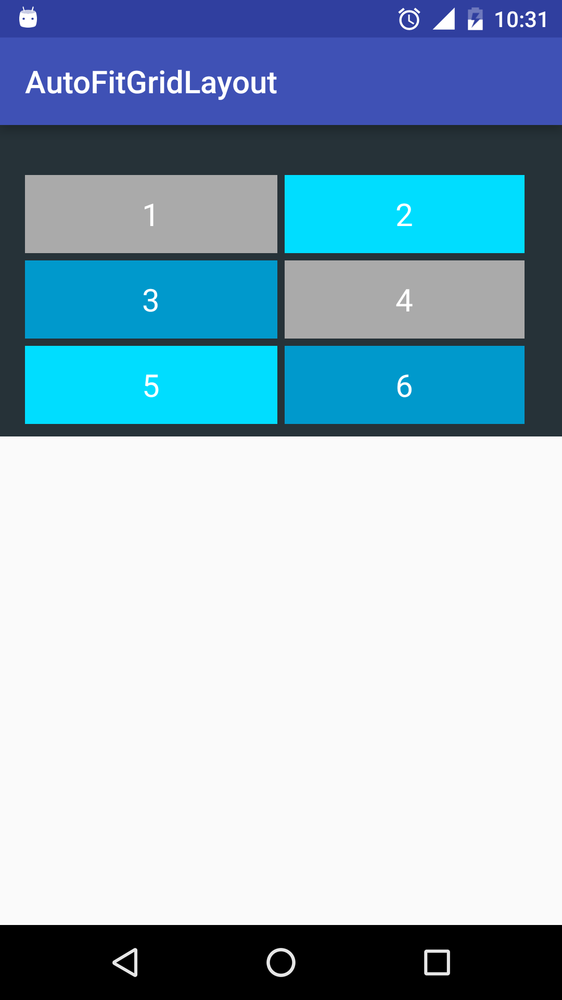
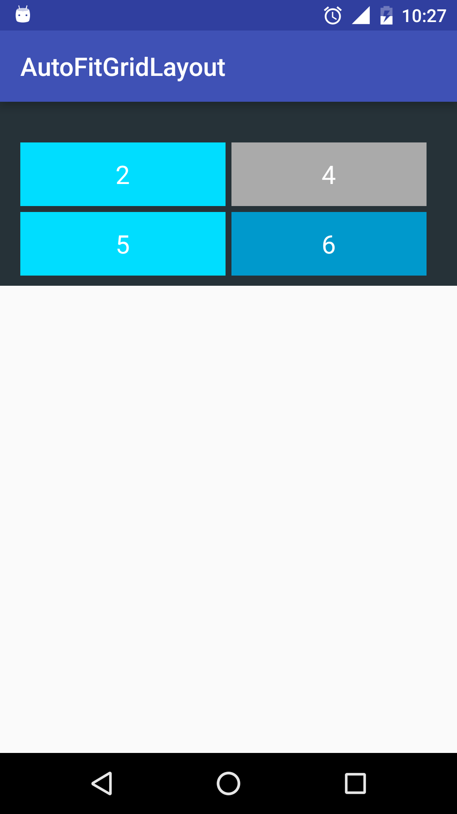

# AutoFitGridLayout
It is a layout like GridLayout. But children in it will fill the column.

# How to Use?
Just copy the class `AutoFitGridLayout.java` and `attr.xml` in afgridayout folder to your dir.

In the xml file:

    <com.liuzhuang.afgridlayout.AutoFitGridLayout
        xmlns:app="http://schemas.android.com/apk/res-auto"
        android:layout_width="match_parent"
        android:layout_height="wrap_content"
        android:paddingBottom="8dp"
        android:paddingLeft="16dp"
        android:paddingRight="24dp"
        android:paddingTop="32dp"
        android:background="#263238"
        app:columnCount="2"
        app:horizontalSpace="4.5dp"
        app:verticalSpace="4.5dp">
        <TextView
            android:layout_width="match_parent"
            android:layout_height="50dp"
            android:text="1"
            android:textSize="20dp"
            android:textColor="@android:color/white"
            android:gravity="center"
            android:background="@android:color/darker_gray"/>
        <TextView
            android:layout_width="match_parent"
            android:layout_height="50dp"
            android:text="2"
            android:textSize="20dp"
            android:gravity="center"
            android:textColor="@android:color/white"
            android:background="@android:color/holo_blue_bright"/>
        <TextView
            android:layout_width="match_parent"
            android:layout_height="50dp"
            android:text="3"
            android:textSize="20dp"
            android:gravity="center"
            android:textColor="@android:color/white"
            android:background="@android:color/holo_blue_dark"/>
        <TextView
            android:layout_width="match_parent"
            android:layout_height="50dp"
            android:text="4"
            android:textSize="20dp"
            android:gravity="center"
            android:textColor="@android:color/white"
            android:background="@android:color/darker_gray"/>
        <TextView
            android:layout_width="match_parent"
            android:layout_height="50dp"
            android:text="5"
            android:textSize="20dp"
            android:gravity="center"
            android:textColor="@android:color/white"
            android:background="@android:color/holo_blue_bright"/>
        <TextView
            android:layout_width="match_parent"
            android:layout_height="50dp"
            android:text="6"
            android:gravity="center"
            android:textSize="20dp"
            android:textColor="@android:color/white"
            android:background="@android:color/holo_blue_dark"/>
    </com.liuzhuang.afgridlayout.AutoFitGridLayout>
 
And the original effect:

After setting number 1 & 3 to be `GONE`, the effect is:

# License

	Copyright 2015 Liu Zhuang

	Licensed under the Apache License, Version 2.0 (the "License");
	you may not use this file except in compliance with the License.
	You may obtain a copy of the License at

   		http://www.apache.org/licenses/LICENSE-2.0

	Unless required by applicable law or agreed to in writing, software
	distributed under the License is distributed on an "AS IS" BASIS,
	WITHOUT WARRANTIES OR CONDITIONS OF ANY KIND, either express or implied.
	See the License for the specific language governing permissions and
	limitations under the License.
